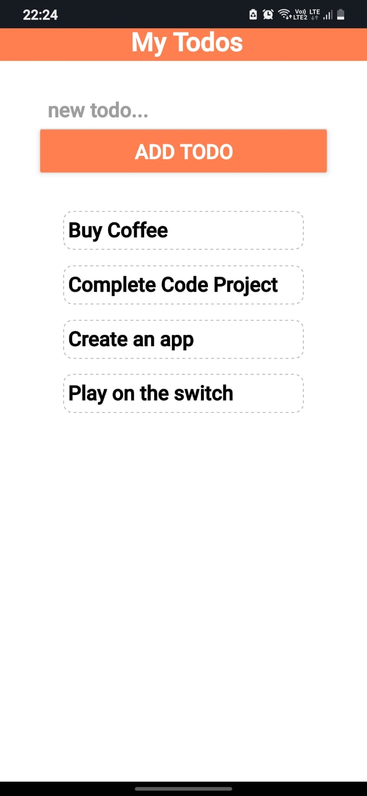
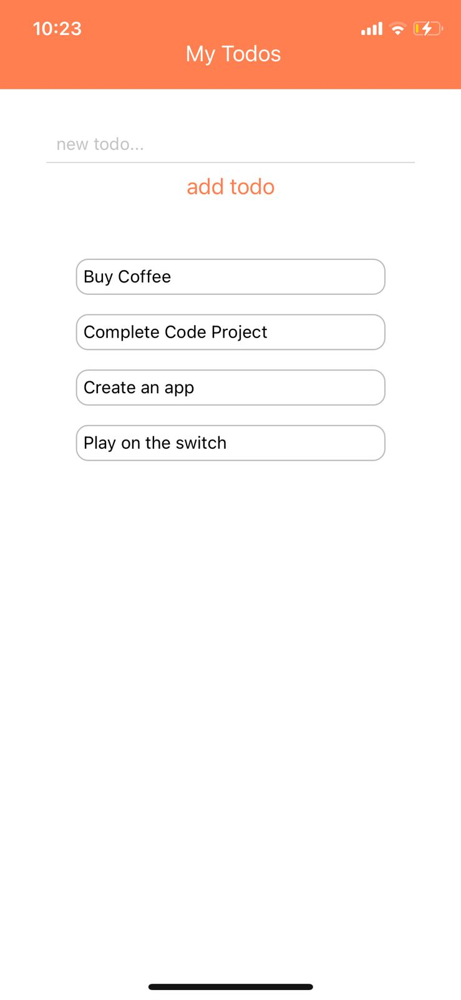

# Todo App

This is an easy use app, in which you can easily add task with a click of button and simmilarly can delete the tasks when completed, just by clicking on them.

## Android



## ios



## Implimentation

First install "react native"

Then clone the repository on your computer

Now use the command to get to the file in CMD
But for this you have to be in the file where your Todo App is kept

``` 
cd todo
```
If you were not in the file in which "todo" file kis kept then use command

```
cd filename
```
Then use the before command

After comming to the "todo" file in CMD

Use
```
npm start
```
To generate a qr code for the app to run on "Expo Go" app

Scan the QR code with Expo Go (Android) or the Camera app (iOS)

### Example QR


then you will be able to use the app on "Expo Go" app

